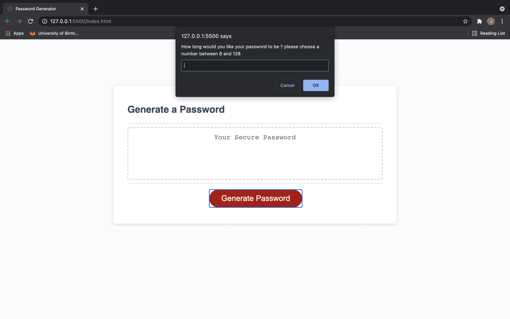
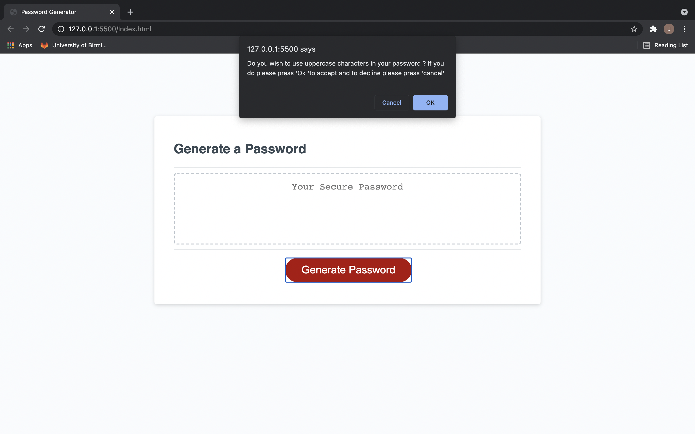
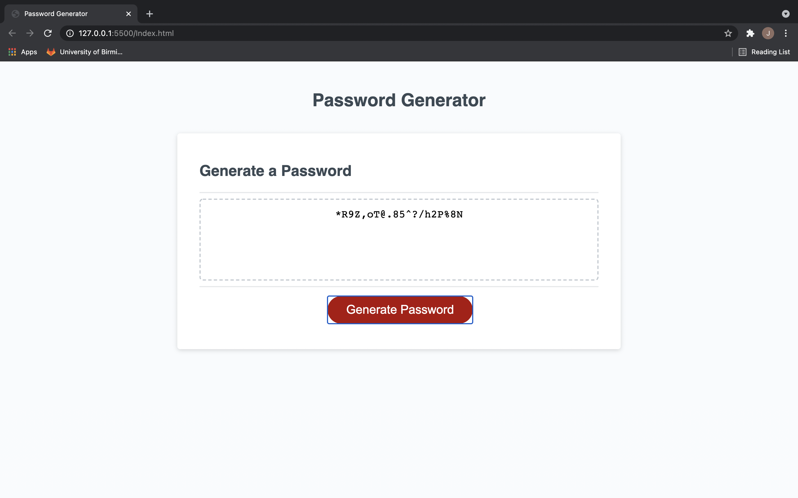

# Password_Generator
## Description
I was tasked with creating a password generator that will allow the user to generate passwords using numbers, letters (both capitol and lower case) and special characters.The password also had to allow the user to choose a password between 8 and 128 charachters from any of the chrachter catagories 
to do this i:
- Included arrays containg the different types of characters that would make up the passswords
- Used codnitional statements to ensure the user couldn't have more characters in their password than specified in the brief
- Made alert prompts that asked the user their preferences 
- Had the password generator return the password back to the user could see it

 

[Click here for the deployed link](https://jcazx.github.io/Password_Generator/
